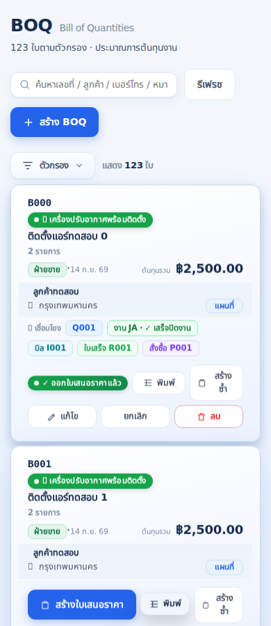
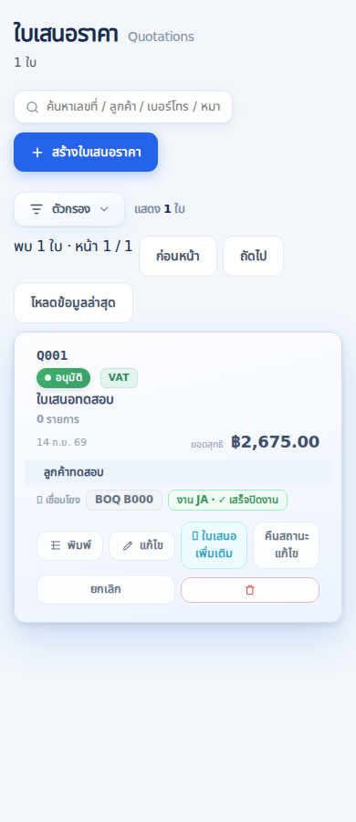
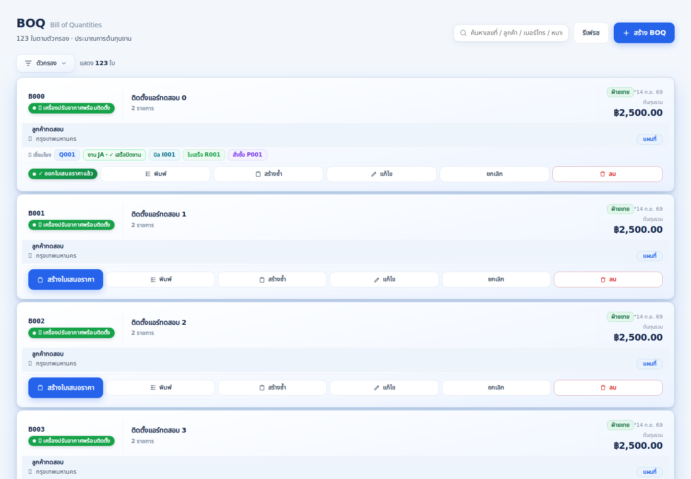

# v836: job read permissions and BOQ pilot

**v836 is live as of 14 September 2026.** PR [#6](https://github.com/arthitchuaychat-blip/AMC-AIR/pull/6) merged as `88557528a22bdd186ce5409f502eac07e2943de2`; all four Vercel deployment checks succeeded. Both https://app.amcair.net and https://amc-air.vercel.app returned HTTP 200 with `/assets/index-CZ-VhUL4.js`, containing v836 and the new BOQ/job bundle code. The deployed commit tree exactly matches the tested local tree. The owner explicitly requested production deployment after reviewing this batch. Migration `20260914101017_job_read_scope_and_boq_page` is installed; its repository filename matches the version assigned by Supabase. The two earlier prerequisite migrations were not rerun.

Read-only production verification passed for all 21 active role/team combinations, including technician, assistant, lead and office scopes. The verification used transaction-local authenticated claims and ended with rollback; it did not change profiles, jobs, visits or documents. Room/team policy and job-status function digests are unchanged. Security-advisor findings are unchanged after excluding observation timestamps. The verification SQL is also exercised by the local PostgreSQL fixture suite.

Prepared against `main` at `7e3ce6bb97ef59e1f99b1290fff770b2f396c7b6`. The initial publication hold was resolved after explicit owner authorization and read-only verification of the connected GitHub owner and the repository's live application destination. Publication and production deployment succeeded. Browser reload on the production domain loaded the new asset and rendered the login screen without application errors. The browser session was unauthenticated; authenticated workflows were verified by the read-only production role checks and synthetic browser screen tests, not by writing real production documents.

## Changes and boundaries

| Area | Result |
| --- | --- |
| Field job loading | Missing RPC, denied access, timeout and network errors stop the read, show a persistent error and allow a fresh retry. No office fallback. |
| Database read permissions | Technician/assistant: own parent assignment **or** own visit; lead: all teams; office: saved job-module permissions. Raw field job headers stay blocked because they contain financial columns. |
| Shared jobs and timelines | Other visits on an authorized shared job stay visible as context. Group lookup and notification metadata use guarded references. Existing own-team status permissions remain in force. |
| Office job data | Use the already-installed read-only `job_order_bundle` RPC; preserve totals, addresses, sales names and document references. A document preview requests its job number. |
| BOQ startup | One page of 50 summaries with totals and related document chips; customers, material catalog and full item bodies load for editing/printing. |
| BOQ search/cache | Search covers all matching pages, phone digits, customer/internal notes and old documents. Date/type/creator filters reset paging. Cache separates accounts, clears on writes and rejects stale account responses. |
| Pilot presentation | Retains shared cards, chips and print templates. Checked 390, 768 and 1440 px layouts, old-document focus, latest approval lock, map links and VAT company choice. |

Quotation already has server pagination in v835; its screen and existing cache, creation and search tests were checked as the companion pilot. This is the first completed menu batch, not a claim that every application menu has been redesigned. Room membership, chat sending, attendance, payroll calculations and production records were not changed. Three existing accounting pagination reads gained a stable `id` ordering to avoid missing/duplicating rows between pages; their calculations are unchanged.

## Evidence

- `npm run test:work-scope`: passes. Includes **481 assertions in an actual local PostgreSQL engine** (PGlite), 12 simulated positions, missing team/inactive user, forged team argument, own/other-team status changes, BOQ paging/search/totals/links and database rollback.
- Field loader tests execute the actual API and JobOrders loader functions, including RPC failures, retries, malformed responses and ten applicable screen roles.
- Actual React screens and application CSS in Chromium: BOQ, Quotation, MyJobs and Schedule. Synthetic records only; all external network calls and unexpected API calls blocked. Checks paging, deep links to old documents, lazy editing, VAT printing, three field positions, persistent errors/retry and a late response after switching teams.
- Cache tests cover initial session delivery, token refresh, account isolation, in-flight logout, write invalidation, empty pages and retry after failure.
- Existing work-round safety: 8/8 checks. Existing chat search: 10/10 checks. Scoped loads: 55/55. Document notes: 35/35.
- Production build passes. Existing bundle-size/TeamChat import warnings remain.
- Compared **48 executable suites** with the untouched v835 worktree: current **42 pass / 6 fail**, baseline 8 fail. No newly failing suite. The two repaired false reports were scoped loading and document-note search after moving filters to SQL. [Per-suite comparison](regression-status.json).

`npm test` is **not fully green**: it stops at the existing status-badge test. The six remaining baseline failures are `test-status-badges`, `test-undefined-vars`, `test-payslip-frozen`, `test-payroll-recheck`, `test-sales-receive`, and `test-tax-buyvat`. In particular, `Settings.jsx` already references undefined `m`, and the loan payment code already references undefined `status`. These require separate investigation; no payroll or notification business rules were changed to silence them.

### Follow-up to Claude's v833–v835 review

The review correctly prioritizes direct database tests for technician/assistant/lead access. The first v836 suite checked safe RPC output but did not explicitly assert direct `quotation_items` reads. Added own-team and other-team quotation/item fixtures with nonzero prices and discounts. Tests now assert direct `quotations`/`quotation_items` reads before and after the proposed migration for every position, field raw job-header denial and continued safe job visibility before migration, and that an attempted office bundle returns no headers or prices for field roles. Required confirmation items still arrive with exactly name/quantity/unit.

Re-read the live `my_role()` definition and relevant policies without changing them: assistant maps to tech and field_sales maps to sales, matching the fixture. The other requested work is in the prepared v836 implementation: no office fallback, bundled office reads with a tested line-discount total, and execution-based field-loader checks replacing the false source-pattern report. The CSS layering observation is recorded as later cleanup; no CSS or production behavior was changed during this review follow-up. The subsequent owner deployment request and rollout status are recorded above.

## Measurements

Read-only aggregate queries on production, using an active admin's existing RLS, with a 10-second statement limit. No identifying record values were returned. The proposed BOQ query was evaluated inline; the function was **not installed** for this measurement.

| Measurement | Previous BOQ list load | Proposed first page |
| --- | ---: | ---: |
| Dataset | 683 documents / 2,858 item rows | 50 document summaries |
| Uncompressed JSON bytes | 2,749,864 | 51,465 |
| Reduction | — | **98.13%** |
| List requests | At least 6 table reads, with extra requests for pagination/creator names | 1 RPC |
| Database execution, one `EXPLAIN ANALYZE` sample | 90.664 ms | 93.823 ms |

The old byte count covers only the six BOQ list datasets; it excludes the additional startup customer/editor/catalog/company/link loaders. The single database timing samples are similar and do **not** establish a database CPU speedup. The measured gain is less data transferred and rendered. Network transfer/compression, concurrent users, the new RLS policies and full navigation latency need measurement after rollout; do not interpret 98.13% as a page-load-time improvement. [Repeatable read-only payload query](../../proposals/measure-v836-boq-payload.sql).

BOQ now records navigation/readiness through the existing speed report. After rollout, compare cold/warm samples on the same device/account/network, label errors separately, and extend the pilot only after verifying document counts and workflows.

## Rollout and recovery

The owner explicitly authorized this reviewed production rollout. The migration below has been applied through Supabase; merging the reviewed PR to `main` automatically deploys Vercel.

1. Production already contains migrations `20260914045754_job_field_read_boundary` and `20260914050118_job_order_bundle_read_only`. Their files are restored to repository history from the inspected installed definitions. **Do not rerun them on this production project.**
2. Already installed: [the new migration](../../../supabase/migrations/20260914101017_job_read_scope_and_boq_page.sql) in one migration transaction before deploying the BOQ UI. Do not rerun this installed migration. On a fresh environment, apply the entire file in one transaction. It changes read policies/functions only, checks its prerequisites and uses a 2-second lock timeout / 15-second statement timeout. A timeout should abort the transaction; do not retry repeatedly during a busy period.
3. Verify the RPC exists and the new policies are present; check own-team/all-team/office visibility with the corresponding accounts. Then merge/deploy the reviewed code and check the displayed v836 build.
4. Verify an existing room, a current shared job/visit, an old BOQ, its linked quotation, edit/print and retry. Run the same device/account speed-report samples and keep the results for the next menu batch.
5. If the BOQ UI needs recovery, restore its previous component first and keep the permission fixes. Removing `boq_page` while the new UI is active would make that menu show a retry error.

[Emergency SQL rollback](../../proposals/rollback-v836-job-read-and-boq.sql) is tested locally. It removes only the newly added actor policies/BOQ function and restores the two previous reference functions. The already-installed field-header and visit restrictions remain. The rollback restores broader pre-v836 office/non-field access, so use it only when necessary; reverting the BOQ UI alone is preferable for a BOQ-only issue.

## Reproduce UI checks

Run from `app/`, with Playwright and Chromium available:

```sh
npm ci
npm run test:work-scope
npm run build
PLAYWRIGHT_MODULE=/absolute/path/to/playwright/index.mjs CHROMIUM_PATH=/absolute/path/to/chromium QA_THAI_FONT=/absolute/path/to/thai-font.woff2 npm run test:menus:browser
```

The browser test serves a temporary local harness with the real screens and CSS. Thai screenshots below use Noto Sans Thai, one of the app's configured fallback fonts; operating-system emoji are not provided in the harness.




